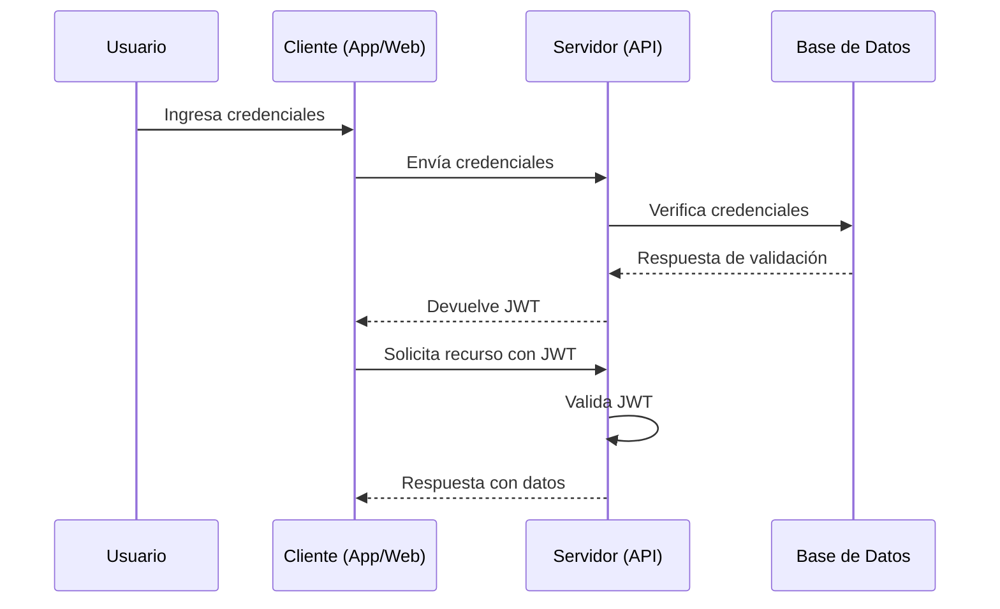
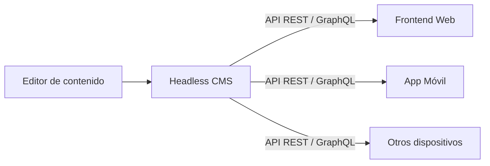
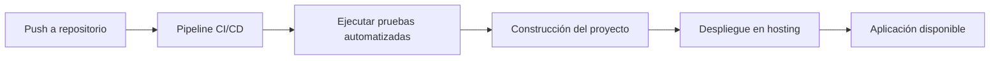
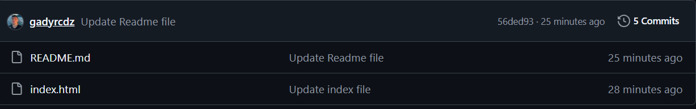
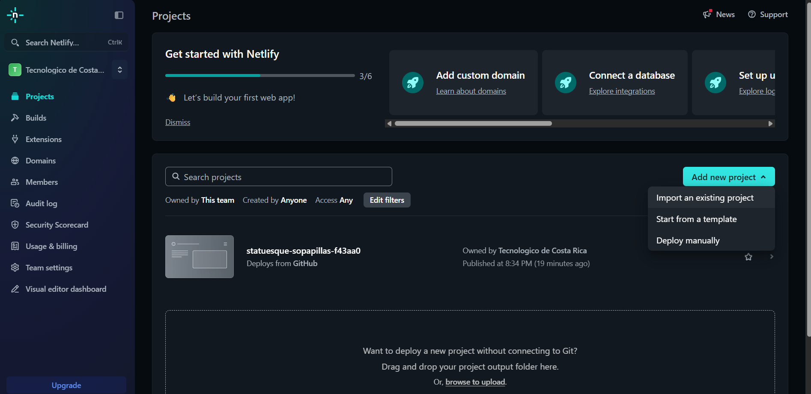
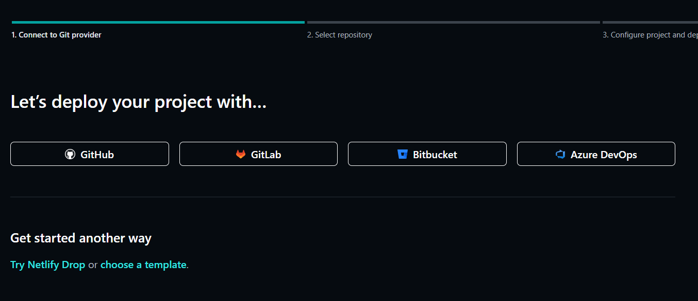
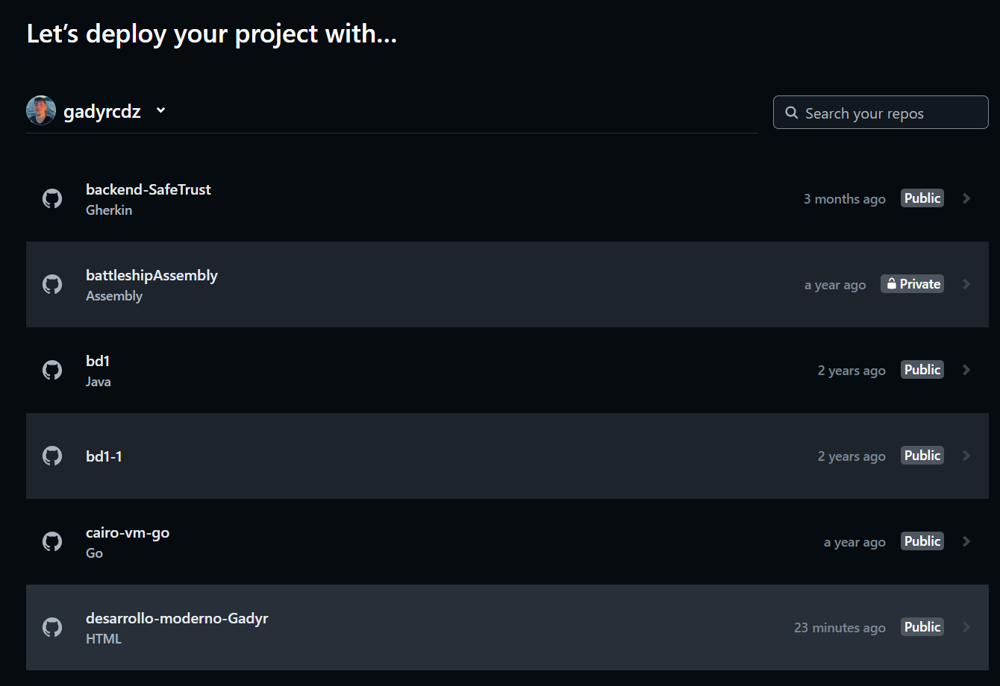
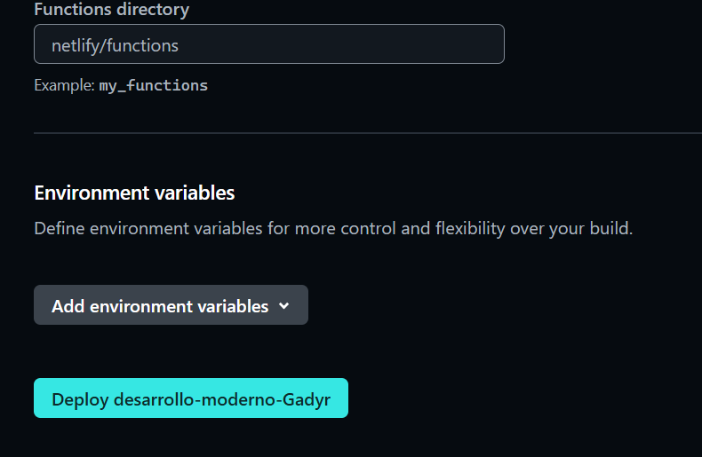

Nombre: Gadyr Calderón Díaz \
Carné: 2022327328 \
Curso: IC-8057 – Introducción al Desarrollo de Páginas Web \
Fecha: 10-8-2025

# 💻 Laboratorio 1 – Tecnologías Web Modernas

> En este archivo se mostrará tanto de manera de investigación como de manera práctica. Un apartado inicial de manera de investigación y una segunda parte con la manera práctica para desplegar este archivo. 
---

## 📋 Contenido

- [✨ Frameworks de desarrollo web](#-Framework-Django)
- [🚀 Control de versiones y trabajo colaborativo](#-control-de-versiones-y-trabajo-coloborativo)
- [💻 Autenticación y seguridad moderna](#-autenticación-y-seguridad-moderna)
- [🌐 Gestores de contenido desacoplados (Headless CMS)](#-gestores-de-contenido-desacoplados-headless-cms)
- [💵 Pasarelas de pago en aplicaciones web](#-pasarelas-de-pago-en-aplicaciones-web)
- [🔧 Automatización del despliegue y hosting moderno](#-automatización-del-despliegue-y-hosting-moderno)
- [🔍 Referencias](#-referencias)
---
## ✨ Framework-Django

- **¿Qué es un framework y qué problema resuelve?**: Django es un framework web de Python de alto nivel, de código abierto y gratuito. Facilita el desarrollo rápido y un diseño limpio y pragmático. Este nos ayuda a resolver el problema de la creación de aplicaciones web complejas al proporcionar una estructura robusta, herramientas integradas y una comunidad activa que lo respalda.

- **Arquitectura general y enfoque (MVC, SPA, SSR, etc.).**: MVC (Modelo-Vista-Controlador) es un patrón arquitectónico utilizado para separar la lógica de una aplicación en tres componentes principales.
     - Model: Representa la lógica de datos y la estructura de la base de datos. Es responsable de acceder a los datos y realizar operaciones de validación y procesamiento. 
     ```jsx
    // Ejemplo de uso
    class Post(models.Model):
        title = models.CharField(max_length=100)
        body = models.TextField()
     ```   
    - Vista (View): Se encarga de la representación visual de los datos. Muestra los datos de la aplicación al usuario, pero no contiene lógica de negocio.
    ```jsx
    <h1>{{ post.title }}</h1>
    <p>{{ post.body }}</p>

    ```
    - Controlador (Controller): Gestiona la lógica de interacción entre el Modelo y la Vista. Es responsable de recibir las acciones del usuario, actualizando el modelo y seleccionando la vista adecuada para presentar los datos.
    ```jsx
    def post_detail(request, post_id):
        post = Post.objects.get(id=post_id)
        return render(request, 'post_detail.html', {'post': post})
    ```
- **Ejemplo práctico documentado (estructura de proyecto, fragmento de código comentado)**: Ejemplo de una clase utilizando Django
    ```jsx
         # blog/models.py

                from django.db import models

                class Articulo(models.Model):
                    # Campos del modelo
                    titulo = models.CharField(max_length=200)          # Titulo del artículo
                    contenido = models.TextField()                     # Cuerpo del articulo
                    fecha_publicacion = models.DateTimeField(auto_now_add=True)  # Fecha de creación
                    publicado = models.BooleanField(default=True)      # Bandera para indicar si se debe mostrar

                    class Meta:
                        verbose_name = "Artículo"
                        verbose_name_plural = "Artículos"

                    def __str__(self):
                        # Representacion en texto para el admin y debugging
                        return self.titulo

    ```
    

- **Comparación breve entre al menos dos frameworks ( Django vs Flask)**: Django es un framework web "baterías incluidas" y de alto nivel, ideal para proyectos grandes y complejos, mientras que Flask es un microframework minimalista y flexible que permite a los desarrolladores elegir las herramientas necesarias para cada proyecto, siendo más adecuado para aplicaciones pequeñas, APIs y microservicios

---
## 🚀 Control de versiones y trabajo coloborativo

- **¿Qué es el control de versiones y por qué es esencial?**: El control de versiones, también conocido como "control de código fuente", es la práctica de rastrear y gestionar los cambios en el código de software.
- **Conceptos clave: repositorio, commit, branch, merge, pull request**: 
    - **Repositorio**: El repositorio es un "espacio" centralizado donde se almacena todo lo que tenga que ver con un trabajo que se esté realizando, este puede ser un repositorio en GitHub, el cuál estará guardado de manera digital.
    - **Commit**: Un commit es una palabra reservada para poder guardar todos los cambios que hemos hecho en nuestro entorno de trabajo, utilizando este como podria ser "git commit -m "Add new Hola mundo" ". 
    - **Branch**: Branch hace referencia a las ramas que pueden ser creadas en entornos de repositorios, para poder realizar distintos trabajos sin tocar la rama principal, de esta manera tenemos el mismo contenido del main pero en una rama externa, utilizando una comando como "git branch Fix-#101" para crear un branch para solucionar algun issue.
    - **Merge**: Merge es para combinar o fucionar los datos de una rama con otra o otras ramas.
    - **Pull request**: El pull request PR es para abrir una solicitud a la rama main para poder integrar lo que tengamos en esa rama, de esta manera, si realizamos un issue y lo logramos solucionar podemos abrir un PR para que estos cambios sean revisados y aceptamos en la rama principal de nuestro proyecto.

- **Flujos de trabajo comunes (Git Flow, trunk-based, feature branches).**: Git Flow utiliza ramas para características, release y hotfix, además de las ramas principales (main y develop). Feature Branch Workflow promueve el desarrollo en ramas dedicadas. Estos modelos facilitan la colaboración, el control de versiones y la gestión de cambios en proyectos de software, aunque cada uno tiene sus propias ventajas y desventajas en cuanto a complejidad y adaptabilidad a diferentes equipos y proyectos.
- **Ejemplo de cómo usar Git en un proyecto (inicialización, commits, ramas).**:
    ```jsx
        #Ejemplo de como clonar un repositorio
        git clone https://github.com/your-username/Jungle-Breezes.git 
        git checkout -b nombreRama #Para crear un branch
        git add holaMundo.py #Para agregar cambios para realizar el commit
        git commit -m "Add hola mundo"
        git push origin nombreRama #Para subir los cambios al repositorio en la rama deseada

    ```

- **Herramientas recomendadas (GitHub, GitLab, Bitbucket).**: GitHub, GitLab y Bitbucket son repositorios de código populares. Los tres ofrecen soluciones para almacenar, versionar y colaborar en proyectos de software. GitHub y GitLab se destacan por su amplia gama de funciones, mientras que Bitbucket, propiedad de Atlassian, se integra bien con otras herramientas de esta empresa

---
## 💻 Autenticación y seguridad moderna

###  Conceptos clave
- **Autenticación**: Proceso de verificar la identidad de un usuario o sistema (ej. usuario/contraseña, biometría).
- **Autorización**: Determinar qué recursos o acciones puede realizar un usuario autenticado.
- **Tokens**: Credenciales digitales que representan la sesión o identidad de un usuario.
- **JWT (JSON Web Token)**: Token en formato JSON firmado digitalmente que transporta información segura entre cliente y servidor.
- **OAuth**: Protocolo de autorización que permite a aplicaciones de terceros acceder a recursos sin exponer credenciales.

---

### 📊 Diagrama de flujo con JWT

- **Buenas prácticas en seguridad web.**:
    - Usar HTTPS para cifrar la comunicación.
    - Configurar tiempos de expiración cortos para tokens.
    - Validar siempre la entrada de datos para prevenir SQL Injection y XSS.
    - Revocar y regenerar tokens ante actividad sospechosa.

- **Aplicaciones reales en plataformas modernas**:
    - GitHub: Autenticación y autorización vía OAuth Apps y JWT para integraciones.
    - Netflix: Manejo de sesiones seguras con tokens y validación de dispositivos.
    - BN Móvil: Uso de BN Token Celular para entrar a la página web.
---
## 🌐 Gestores de contenido desacoplados (Headless CMS)

### 📖 Definición
- **CMS tradicional**: Sistema que gestiona y presenta el contenido en un mismo entorno. Ejemplo: WordPress (con su propio frontend).
- **Headless CMS**: Gestiona el contenido pero no se encarga de la presentación. Proporciona el contenido a través de APIs para que cualquier frontend lo consuma.

---
### 🏗️ Arquitectura basada en APIs
Un Headless CMS expone el contenido mediante **REST** o **GraphQL APIs**, lo que permite:
1. Crear contenido en un panel de administración.
2. Almacenar datos en una base de datos interna del CMS.
3. Servir el contenido mediante API al frontend (web, móvil, IoT, etc.).


---
- **Ventajas.**:
    - Flexibilidad: El mismo contenido se usa en múltiples plataformas.
    - Escalabilidad: Separar backend y frontend facilita actualizaciones independientes.
    - Tecnología libre: El frontend puede estar hecho en React, Vue, Angular, etc.
- **Limitaciones.**:
    - Mayor complejidad inicial: Requiere configurar el consumo de APIs.
    - Sin frontend por defecto: Debe desarrollarse completamente.
    - Costos adicionales: Algunos servicios cobran por consultas o almacenamiento.
- **Casos de uso comunes.**:
    - Sitios multi-plataforma (web + app móvil).
    - Proyectos multilingües con gran volumen de contenido.
    - E-commerce con frontend personalizado.
---
- **Ejemplo de cómo se conecta el frontend a un CMS headless**:
```jsx
import { useEffect, useState } from "react";

function Blog() {
  const [posts, setPosts] = useState([]);

  useEffect(() => {
    fetch("https://mi-cms.com/graphql", {
      method: "POST",
      headers: { "Content-Type": "application/json" },
      body: JSON.stringify({
        query: `
          {
            posts {
              title
              content
            }
          }
        `,
      }),
    })
      .then((res) => res.json())
      .then((data) => setPosts(data.data.posts));
  }, []);

  return (
    <div>
      <h1>Blog</h1>
      {posts.map((p, i) => (
        <article key={i}>
          <h2>{p.title}</h2>
          <p>{p.content}</p>
        </article>
      ))}
    </div>
  );
}

export default Blog;

```
---
## 💵 Pasarelas de pago en aplicaciones web

### 📖 Definición
- **Pasarela de pago**: Servicio que actúa como intermediario entre un comercio y las entidades financieras para procesar pagos en línea de forma segura.
- **Rol en una aplicación moderna**: Facilitar transacciones electrónicas integrando métodos como tarjetas de crédito/débito, transferencias y pagos móviles.

---

### 🛠️ Requisitos comunes
- **Cuenta de comercio**: Contrato con el proveedor de pagos o banco.
- **Seguridad**: Cumplimiento de estándares como **PCI DSS** y uso de **HTTPS**.
- **Integración técnica**: Uso de SDKs, APIs REST o Webhooks.

---

### ⚖️ Ventajas
- Acceso a múltiples métodos de pago.
- Procesamiento seguro y cumplimiento normativo.
- Experiencia de compra más fluida.

### 🚧 Limitaciones
- Costos por transacción.
- Dependencia de terceros.
- Posibles retrasos por validaciones antifraude.

---

### 📊 Comparativa de pasarelas

| Característica        | Stripe                                | TiloPay                              |
|----------------------|---------------------------------------|---------------------------------------|
| **Cobertura**        | Internacional                         | Enfocado en Latinoamérica            |
| **Integración**      | API REST, SDKs en múltiples lenguajes | API REST, plugins para e-commerce    |
| **Seguridad**        | PCI DSS Nivel 1, 3D Secure             | Cumplimiento PCI DSS                 |
| **Métodos de pago**  | Tarjeta, Apple Pay, Google Pay, etc.  | Tarjeta, transferencias locales       |
| **Costo aprox.**     | 2.9% + tarifa fija por transacción     | Variable según país y tipo de pago   |

---

## 🔧 Automatización del despliegue y hosting moderno

### 📖 CI/CD
- **CI/CD (Integración Continua / Despliegue Continuo)**: Práctica de desarrollo que automatiza la integración de cambios de código, ejecución de pruebas y despliegue en entornos productivos.
- **Beneficios**:
  - Detecta errores rápidamente.
  - Reduce tiempos de entrega.
  - Asegura despliegues consistentes.

---

### 🏠 Hosting estático vs dinámico
- **Estático**: Archivos HTML, CSS y JS pre-generados, servidos tal cual (ej. Netlify, GitHub Pages).  
  ✅ Rápido y económico. ❌ Menos flexible para contenido dinámico.
- **Dinámico**: Genera contenido en tiempo real desde el servidor (ej. Heroku, Vercel con funciones serverless, servidores Node.js).  
  ✅ Flexible y personalizable. ❌ Mayor costo y mantenimiento.

---

### 🔄 Flujo de despliegue automatizado

---
### 📜  Documentación para desplegar 

- **GIT**: Tienes que tener los archivos ya en un repositorio en tu GitHub,
en este caso tiene que tener el index.html y el README.md

- **Netlify**: Tienes que ingresar en Netlify y crearte una cuenta, 
puedes hacer el sign up con Github
- **Netlify**: Buscas el apartado de **Projects**, buscas la opción de **Add new project**, luego en **Import an existing project**

- **Netlify**: En la ventana utilizas GitHub 

- **Netlify**: Seleccionas el repositorio que deseas publicar
 
- **Netlify**: Seleccionas Deploy, y ya tendrías el projecto publicado


---


## 🔍 Referencias
 
- https://urianviera.com/django/arquitectura-mvc-en-django
- https://tutorialmarkdown.com/emojis
- https://www.markdownguide.org/basic-syntax/
- https://www.maestrosdelweb.com/curso-django-las-vistas/
- https://kinsta.com/es/blog/flask-vs-django/
- https://www.ilimit.com/es/blog/tecnologico-2/automatizacion-despliegue-continuo-30
- https://www.ibm.com/mx-es/think/topics/continuous-deployment
- https://support.typora.io/Draw-Diagrams-With-Markdown/
- https://www.siteground.es/kb/sitio-web-estatico-vs-dinamico/
- https://www.figma.com/resource-library/static-vs-dynamic-website/
- https://auth0.com/docs/secure/tokens/json-web-tokens/json-web-token-structure
- https://www.youtube.com/watch?v=7W6-jSOFMgM&t=741s